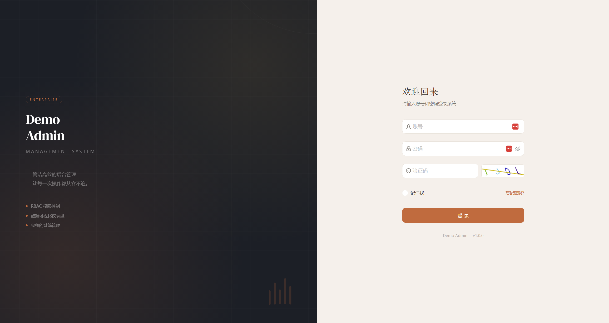
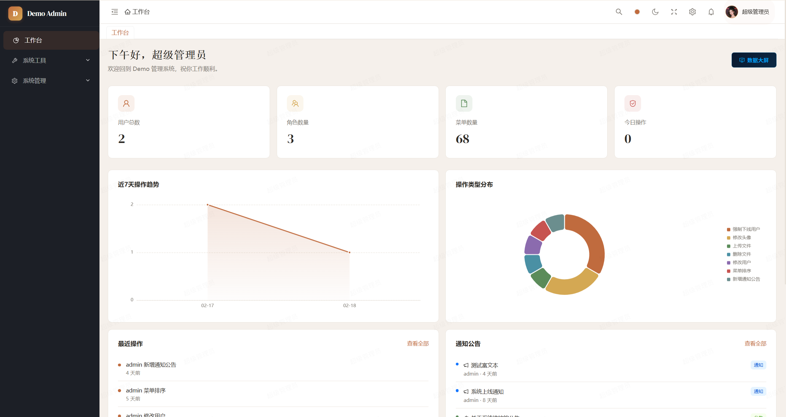
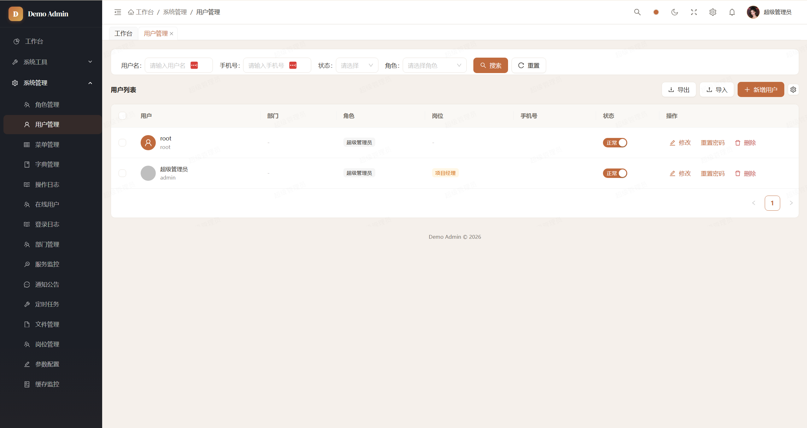
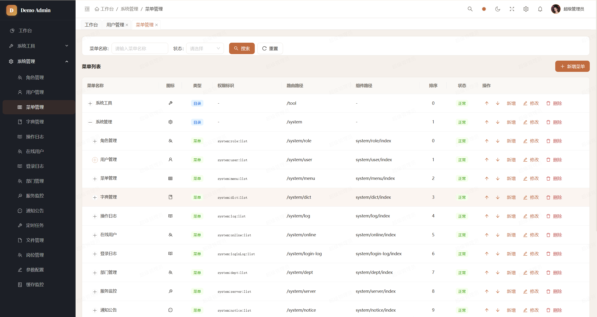
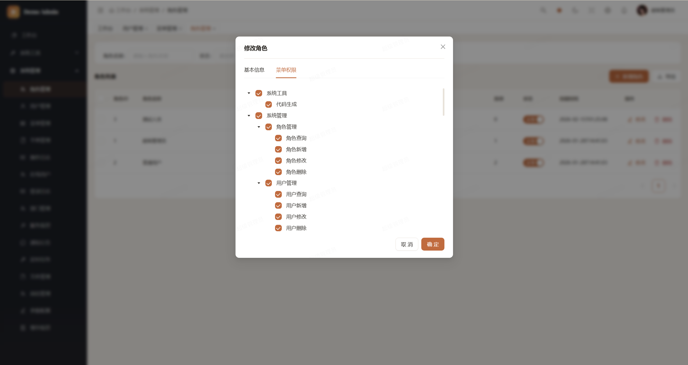
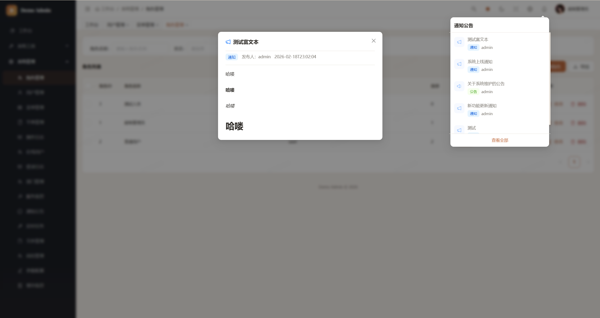
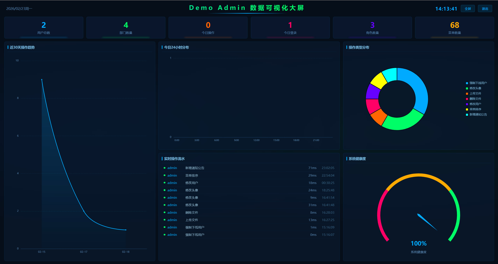
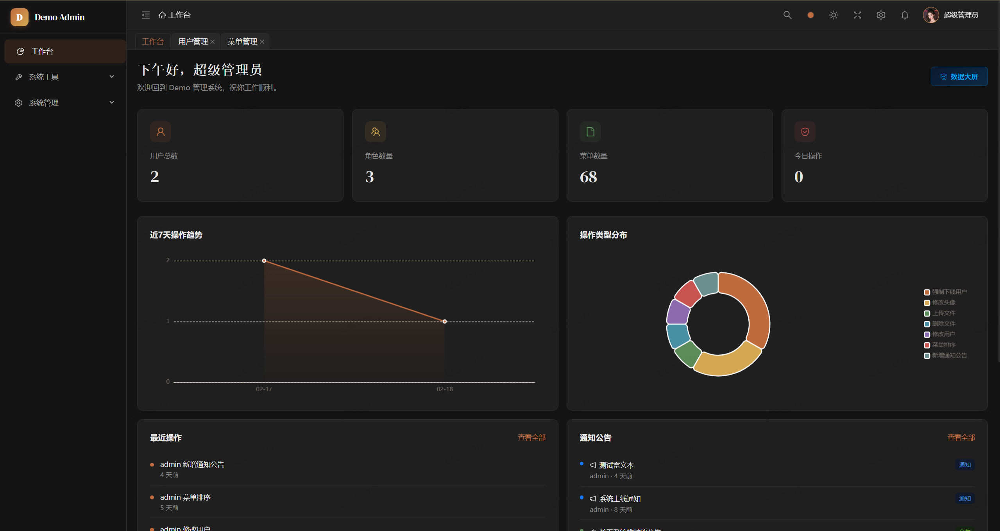

# Demo Management 后台管理系统

基于 Spring Boot + React 的全栈后台管理系统，涵盖用户权限、系统监控、代码生成等企业级功能模块。

## 在线演示

🔗 **[http://manage.fsmdev.top/dashboard](http://manage.fsmdev.top/dashboard)**

> ⚠️ 演示站部署在 Oracle Cloud 1GB 内存的免费小鸡上，速度非常慢，仅供预览。建议 clone 到本地使用 Docker Compose 一键部署体验完整功能。
>
> 账号：`admin` / 密码：`admin123`

## 技术栈

| 层级 | 技术 |
|------|------|
| **后端** | Java 8, Spring Boot 2.7, Spring Security (JWT), MyBatis-Plus 3.5, MySQL 8, Redis |
| **前端** | React 19, TypeScript 5.9, Vite 7, Ant Design 6, ECharts, React Router 7 |
| **部署** | Docker, Docker Compose, Nginx |
| **文档** | Knife4j (Swagger) |

## 功能模块

### 认证与权限
- JWT 登录认证 + 算术验证码
- RBAC 权限控制（菜单权限 + 按钮权限）
- 密码错误锁定机制（5次错误锁定30分钟）
- 登录设备管理（查看/退出设备）

### 系统管理
- 用户管理（CRUD、角色/岗位分配、Excel 导入导出）
- 角色管理 / 菜单管理 / 部门管理 / 岗位管理
- 字典管理 / 参数配置
- 通知公告（富文本编辑、已读追踪、WebSocket 实时推送）
- 在线用户 / 服务器监控 / 缓存监控

### 安全增强
- 数据权限（@DataScope，按部门隔离）
- 接口限流（@RateLimit，Redis + Lua 原子操作）
- 防重复提交（@RepeatSubmit，Redis SETNX 原子锁）

### 日志 & 监控
- 操作日志（AOP 自动记录，变更对比 old/new，Excel 导出）
- 登录日志（日期范围筛选）
- 定时任务管理 + 执行日志

### 开发工具
- 代码生成器
- 接口文档（Knife4j 集成）
- 文件管理（上传/预览/下载，支持 PDF/视频/音频/文本）

### 可视化
- 仪表盘（统计卡片、ECharts 趋势图、操作分布）
- 数据大屏（全屏科技风格，6卡片+4图表+实时流水）

### 体验优化
- 4套主题色（棕橙/靛蓝/翠绿/雅紫）+ 暗黑模式
- 全局搜索（Ctrl+K）、标签页右键菜单、面包屑导航
- 水印（可关闭）、表格列自定义、响应式布局
- WebSocket 实时通知（指数退避重连）

## 项目结构

```
demo-management/
├── backend/                    # Spring Boot 后端
│   ├── src/main/java/com/demo/admin/
│   │   ├── common/             # 公共模块（异常、工具、切面、注解）
│   │   ├── modules/            # 业务模块
│   │   │   ├── auth/           # 认证模块
│   │   │   ├── system/         # 系统管理
│   │   │   ├── monitor/        # 监控模块
│   │   │   └── tool/           # 开发工具
│   │   └── security/           # 安全配置
│   ├── src/main/resources/
│   │   ├── mapper/             # MyBatis XML
│   │   ├── sql/                # 数据库脚本
│   │   ├── templates/          # 代码生成模板
│   │   └── application.yml
│   ├── src/test/               # 单元测试
│   └── Dockerfile
├── frontend/                   # React 前端
│   ├── src/
│   │   ├── components/         # 公共组件
│   │   ├── layouts/            # 布局组件
│   │   ├── pages/              # 页面
│   │   ├── store/              # 状态管理
│   │   ├── hooks/              # 自定义 Hooks
│   │   ├── services/           # API 服务
│   │   └── utils/              # 工具函数
│   ├── nginx.conf
│   └── Dockerfile
├── docker-compose.yml
└── README.md
```

## 快速开始

### 环境要求
- Java 8+
- Node.js 18+
- MySQL 8.0
- Redis 7+

### 本地开发

**1. 数据库初始化**
```bash
mysql -u root -p < backend/src/main/resources/sql/init.sql
mysql -u root -p demo_admin < backend/src/main/resources/sql/file_management.sql
mysql -u root -p demo_admin < backend/src/main/resources/sql/post_config_cache.sql
```

**2. 启动后端**
```bash
cd backend
mvn spring-boot:run
# 后端启动在 http://localhost:8080/api
```

**3. 启动前端**
```bash
cd frontend
npm install
npm run dev
# 前端启动在 http://localhost:3000
```

### Docker 一键部署

#### 环境准备

1. 安装 [Docker Desktop for Windows](https://www.docker.com/products/docker-desktop/)
2. 安装完成后重启电脑
3. 打开 Docker Desktop，等待左下角状态变绿（Engine running）
4. 验证安装：`docker --version` 和 `docker compose version`

#### 构建 & 启动

```bash
cd /path/to/demo-management
docker compose up -d --build
```

首次构建约 5-10 分钟（下载基础镜像和依赖），后续启动秒级。

该命令自动完成：
- 拉取 MySQL 8.0、Redis 7 基础镜像
- 编译后端 Java 代码，生成后端镜像（`backend/Dockerfile`）
- 编译前端代码，生成前端镜像（`frontend/Dockerfile`）
- 按依赖顺序启动：MySQL → Redis → Backend → Frontend
- MySQL 容器自动执行 `init.sql` 建表和初始化数据

启动完成后访问 http://localhost:3000 ，使用 `admin / admin123` 登录。

> **生产部署提示**：仅前端容器暴露宿主机 3000 端口，后端/MySQL/Redis 仅在 Docker 内部网络通信。建议使用宿主机 Nginx 反代 `proxy_pass http://127.0.0.1:3000` 到 80/443 端口并配置 SSL。

#### 验证服务状态

**1. 查看容器运行状态**
```bash
docker compose ps
```
正常应显示 4 个容器状态为 `Up (healthy)` 或 `Up`：
```
demo-mysql      Up (healthy)
demo-redis      Up (healthy)
demo-backend    Up
demo-frontend   Up
```

**2. 查看服务日志**
```bash
# 后端日志（关键词：Started AdminApplication）
docker compose logs backend | tail -20

# MySQL 日志（确认初始化完成）
docker compose logs mysql | tail -20

# 前端 Nginx 日志
docker compose logs frontend | tail -10
```

**3. 逐层测试连通性**
```bash
# MySQL 连接 + 查看表
docker compose exec mysql mysql -uroot -p123456 -e "USE demo_admin; SHOW TABLES;"

# Redis 连接
docker compose exec redis redis-cli ping
# 应返回 PONG

# 后端 API
curl http://localhost:8080/api/auth/captcha
# 应返回 JSON：{"code":200,"data":{"key":"...","image":"..."}}

# 前端页面
curl -I http://localhost
# 应返回 HTTP/1.1 200 OK
```

#### 常用操作

```bash
# 停止所有容器
docker compose down

# 停止并清除数据（重新初始化数据库）
docker compose down -v

# 修改代码后重新构建某个服务
docker compose up -d --build backend
docker compose up -d --build frontend

# 进入容器内部排查问题
docker compose exec backend sh
docker compose exec mysql bash
```

#### 常见问题

| 问题 | 排查方式 | 解决方法 |
|------|---------|---------|
| 后端启动失败 | `docker compose logs backend` | 检查是否数据库未就绪，等 MySQL healthy 后重启：`docker compose restart backend` |
| 端口被占用 | `netstat -ano \| findstr :80` | 停掉占用端口的程序，或修改 `docker-compose.yml` 中的端口映射 |
| MySQL 初始化失败 | `docker compose logs mysql` | `docker compose down -v` 清除数据后重新 `up` |
| 前端白屏 | 浏览器 F12 → Network 面板 | 检查 API 请求是否 502/404，确认后端容器正常运行 |
| 镜像构建失败 | 查看构建日志中的报错 | 通常是网络问题，重试 `docker compose up -d --build` |

### 运行测试

```bash
cd backend
mvn test
# 61 个单元测试，覆盖 Utils / Security / Aspect / Service / Controller 层
```

## 默认账号

| 账号 | 密码 | 角色 |
|------|------|------|
| admin | admin123 | 超级管理员 |

## 项目截图

### 登录页


### Dashboard 首页


### 用户管理


### 菜单管理


### 角色权限管理


### 富文本公告


### 数据大屏


### 暗色主题


## License

MIT
